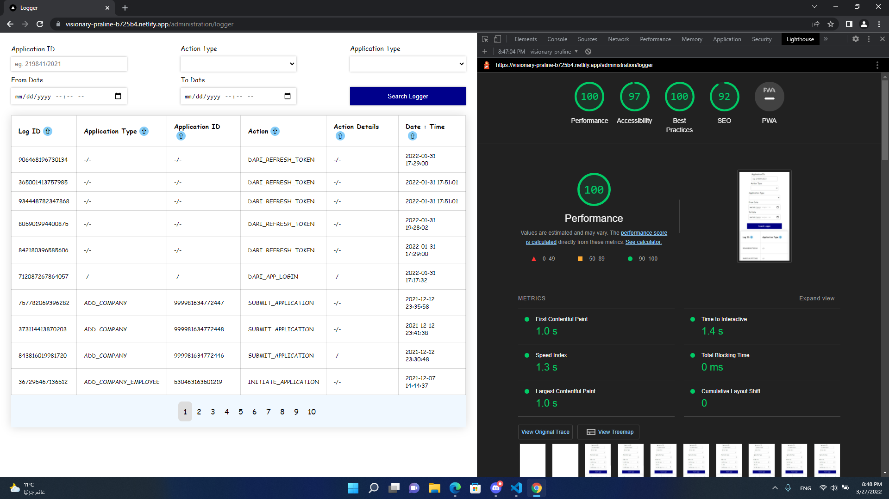
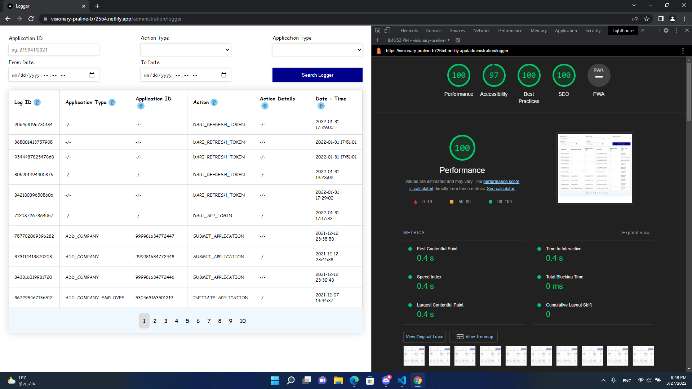

## Live Demo

https://visionary-praline-b725b4.netlify.app

## Getting Started

First, download nodejs version > 8, https://nodejs.org/en/

Run the command

```bash
npm install
```

to install all the required dependancies, then to run the development server:

```bash
npm run dev
# or
yarn dev
```

Open http://localhost:3000 with your browser to see the result.

## Testing

To learn more about tools used in this project for testing, take a look at the following resources:

- [Lighthouse]() - learn about Next.js features and API.
- [Cypress]() - learn about Cypress features.

The result of testing using the Lighthouse tools are the following:



Run the command to start the unit-test

```bash
npm cypress
```

## Learn More

To learn more about tools used in this project, take a look at the following resources:

- [Next.js Documentation](https://nextjs.org/docs) - learn about Next.js features and API.
- [Learn Next.js](https://nextjs.org/learn) - an interactive Next.js tutorial.
- [Cypress](https://docs.cypress.io/) - learn about Cypress features.
- [Lighthouse](https://developers.google.com/web/tools/lighthouse) - learn about Lighthouse tool.
